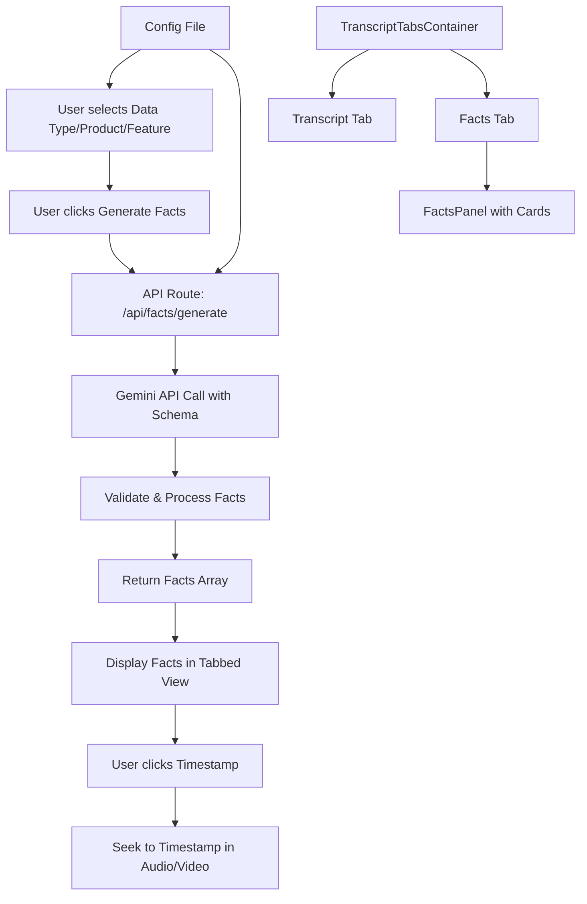

# Fact Generation Feature Implementation

## Overview

This plan implements the atomic fact generation feature that uses Gemini AI to extract structured "nuggets" (facts) from transcripts. The feature includes dropdown inputs for research metadata (Data Type, Product, Feature) and displays generated facts in the main transcript area.

## Architecture

## Implementation Steps

### 1. Create Configuration File

**File**: `lib/fact-generation-config.ts`

-   Define predefined options for Data Type, Product, and Feature dropdowns
-   Export constants that can be easily modified
-   Structure: `{ dataTypes: string[], products: string[], features: string[] }`

### 2. Add Research Metadata Component

**File**: `app/components/sidebar/research-metadata.tsx`

-   New component with three Select dropdowns (Data Type, Product, Feature)
-   Place in sidepanel at the specified location (in `div.p-4 space-y-4`)
-   Position: Above or below MetadataPanel
-   Use existing Select component from `components/ui/select.tsx`
-   Accept props: `dataType`, `product`, `feature`, and change handlers
-   Store selected values in parent component state

### 3. Update Main Page Component

**File**: `app/page.tsx`

-   Add state for `dataType`, `product`, `feature` (strings, nullable)
-   Import and render `ResearchMetadata` component in sidepanel
-   Add state for `facts` array and `isGeneratingFacts` boolean
-   Add handler function `handleGenerateFacts` that calls the API route
-   Pass necessary props to ResearchMetadata component

### 4. Create Facts API Route

**File**: `app/api/facts/generate/route.ts`

-   Accept POST request with:
    -   `transcriptData`: Full transcript JSON from ElevenLabs
    -   `dataType`: Selected data type
    -   `product`: Selected product
    -   `feature`: Selected feature
-   Use Gemini API (Google Generative AI SDK)
-   Construct system prompt using template from `LLM_TASK.MD`
-   Use strict JSON schema from `LLM_TASK.MD` for response validation
-   Implement validation:
    -   Verify verbatim quotes exist in transcript text
    -   Inject audio events (laughter, sighs) if available
-   Return array of facts with proper TypeScript types
-   Handle errors gracefully

### 5. Add Type Definitions

**File**: `lib/types.ts`

-   Add `Fact` interface matching the schema:
    -   `fact_id: string`
    -   `verbatim_quote: string`
    -   `timestamp: string` (HH:MM:SS format)
    -   `speaker_label: string`
    -   `sentiment: "Positive" | "Neutral" | "Negative"`
    -   `theme: string` (from enum list)
    -   `summary_of_observation: string`
-   Add `ExtractionResponse` interface: `{ facts: Fact[] }`

### 6. Create Tabs Component

**File**: `components/ui/tabs.tsx`

-   Create shadcn/ui tabs component using Radix UI Tabs primitives
-   Follow the same pattern as other UI components in the project
-   Export: `Tabs`, `TabsList`, `TabsTrigger`, `TabsContent`

### 7. Create Facts Display Component

**File**: `app/components/facts/facts-panel.tsx`

-   Display generated facts as a list of cards
-   Each fact card should include:
    -   Verbatim quote (highlighted/prominent)
    -   Clickable timestamp (HH:MM:SS format) that seeks to that time when clicked
    -   Speaker label with avatar/color
    -   Sentiment badge (color-coded: Positive/Neutral/Negative)
    -   Theme tag/chip
    -   Summary of observation
    -   Fact ID (optional, for reference)
-   Cards should be styled consistently with the app's design system
-   Handle empty state (no facts generated yet) with helpful message
-   Show loading state during generation (skeleton cards or spinner)

### 8. Create Tabbed Content Container

**File**: `app/components/transcript/transcript-tabs-container.tsx`

-   New container component that wraps TranscriptEditor and FactsPanel
-   Uses Tabs component to switch between "Transcript" and "Facts" views
-   Tab structure:
    -   Tab 1: "Transcript" - shows TranscriptEditor
    -   Tab 2: "Facts" - shows FactsPanel
-   Accepts all props needed for both components
-   Handles tab state management
-   Position: Replaces TranscriptEditor in the main area (`div.flex flex-1 flex-col overflow-hidden bg-background`)

### 9. Update Transcript Editor Layout

**File**: `app/page.tsx`

-   Replace direct TranscriptEditor usage with TranscriptTabsContainer
-   Pass facts array and related handlers to TranscriptTabsContainer
-   Ensure facts can trigger seek functionality when timestamp is clicked

### 10. Environment Variables Setup

**File**: `.env.local` (documentation)

-   Add `GEMINI_API_KEY` environment variable
-   Document in README or add to `.env.example`

### 11. Add Timestamp Conversion Utility

**File**: `lib/utils.ts`

-   Add function `parseTimestampToSeconds(timestamp: string): number`
-   Converts HH:MM:SS format (from Gemini response) to seconds (for seeking)
-   Handles edge cases (MM:SS format, invalid formats)
-   Example: `"00:04:12"` → `252` seconds

### 12. Install Gemini SDK (if needed)

-   Check if `@google/generative-ai` package is needed
-   Add to `package.json` dependencies if not already present
-   Check if `@radix-ui/react-tabs` is needed for tabs component

## File Changes Summary

### New Files

-   `lib/fact-generation-config.ts` - Configuration for dropdown options
-   `app/components/sidebar/research-metadata.tsx` - Dropdown inputs component
-   `app/api/facts/generate/route.ts` - API route for fact generation
-   `components/ui/tabs.tsx` - Tabs UI component (shadcn/ui)
-   `app/components/facts/facts-panel.tsx` - Facts display component (list of cards)
-   `app/components/transcript/transcript-tabs-container.tsx` - Tabbed container for Transcript/Facts views

### Modified Files

-   `app/page.tsx` - Add state management and integrate new components
-   `lib/types.ts` - Add Fact and ExtractionResponse interfaces
-   `lib/utils.ts` - Add parseTimestampToSeconds utility function

### Configuration

-   `.env.local` - Add GEMINI_API_KEY (user will provide)

## Key Implementation Details

1. **Tab Navigation**: Use tabs to switch between Transcript and Facts views in the main content area (same container as TranscriptEditor)
2. **Facts Display**: Facts shown as list of cards with all metadata (quote, timestamp, speaker, sentiment, theme, summary)
3. **Timestamp Navigation**: Clicking a timestamp in a fact card seeks the audio/video player to that time (convert HH:MM:SS to seconds using `parseTimestampToSeconds` utility)
4. **Gemini API Integration**: Use Google's Generative AI SDK with structured output (JSON schema) to ensure consistent response format
5. **Validation**: Verify verbatim quotes exist in transcript before returning facts
6. **Audio Events**: If available in transcript data, inject audio events into fact summaries
7. **Error Handling**: Graceful error messages for API failures, missing selections, etc.
8. **Loading States**: Show loading indicators during fact generation
9. **User Experience**: Disable generate button until all three dropdowns are selected
10. **Layout**: Facts panel uses the same container structure as TranscriptEditor (`div.h-full overflow-y-auto px-6 py-4 bg-background`)

## Dependencies

-   `@google/generative-ai` (may need to be added to package.json)
-   `@radix-ui/react-tabs` (may need to be added to package.json for tabs component)
-   Existing Select component from shadcn/ui
-   Existing transcript data structures
-   Card component from shadcn/ui (for fact cards)
