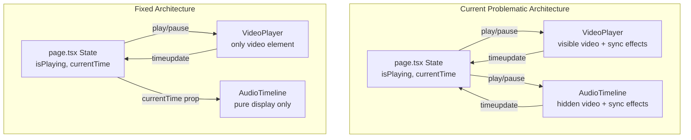

# Fix Timeline Zoom, Playhead Scaling, and Video Sync

## Problem Analysis

There are 4 interconnected issues:

1. **Playhead doesn't scale with zoom** - The playhead is positioned outside the zoom transform container, so when zooming, the timeline content scales but the playhead stays at the wrong position.

2. **Timeline click position is incorrect when zoomed** - The click handler incorrectly divides by `zoomScale` when `getBoundingClientRect()` already returns the scaled dimensions.

3. **Choppy play/pause** - Two video/audio elements exist (one visible in `VideoPlayer`, one hidden in `AudioTimeline`), causing race conditions and state thrashing when both try to sync playback.

4. **Timestamps already clickable** - This is already implemented via `handleTimestampMarkerClick`.

## Architecture



## Changes Required

### 1. Remove Hidden Video from AudioTimeline

**File**: [app/components/timeline/audio-timeline.tsx](app/components/timeline/audio-timeline.tsx)

Remove:

-   Lines 69-72: `internalVideoRef` and `videoElement` logic
-   Lines 83-115: All `useEffect` hooks that sync playback (these cause the choppiness)
-   Lines 161-182: Hidden video/audio element rendering

The component should become a pure presentation component receiving only `currentTime` as a prop.

### 2. Fix Playhead Position with Zoom

**File**: [app/components/timeline/audio-timeline.tsx](app/components/timeline/audio-timeline.tsx)

Current playhead (lines 189-196) is outside zoom transform. Move it inside OR apply zoom compensation:

```typescript
// Option A: Apply zoom to playhead position
<div style={{ left: `${progressPercentage * zoomScale}%` }}>

// Option B: Move playhead inside zoom transform and inverse scale its width
```

Recommended: Keep playhead outside but multiply position by zoomScale for visual alignment with the zoomed timeline.

### 3. Fix Timeline Click Calculation

**File**: [app/components/timeline/audio-timeline.tsx](app/components/timeline/audio-timeline.tsx)

Current code (lines 120-137) incorrectly divides by `zoomScale`:

```typescript
const scaledX = x / zoomScale; // WRONG
const percentage = (scaledX / rect.width) * 100;
```

Fix: Since `getBoundingClientRect()` returns visual (scaled) dimensions, the click position directly maps:

```typescript
const percentage = (x / rect.width) * 100;
const timestamp = (percentage / 100) * duration;
```

### 4. Update Props Interface

Remove unnecessary props from `AudioTimelineProps`:

-   `fileUrl`, `fileType` - no longer needed without internal video
-   `isPlaying` - keep for progress indicator styling
-   `onTimeUpdate` - no longer needed
-   `videoRef` - no longer needed

Keep:

-   `currentTime` - for playhead position
-   `onSeek`, `onTimestampClick` - for click handling

### 5. Update Parent Components

**File**: [app/components/timeline/speakers-timeline-container.tsx](app/components/timeline/speakers-timeline-container.tsx)

Remove props that are no longer passed to `AudioTimeline`:

-   `fileUrl`, `fileType`
-   `videoRef`
-   `onTimeUpdate`

**File**: [app/page.tsx](app/page.tsx)

-   Remove `timelineVideoRef` - no longer needed
-   Simplify handlers that tried to sync two video elements

## Implementation Order

1. First fix the click calculation (quick fix)
2. Fix playhead scaling (quick fix)
3. Remove hidden video element and related effects from
