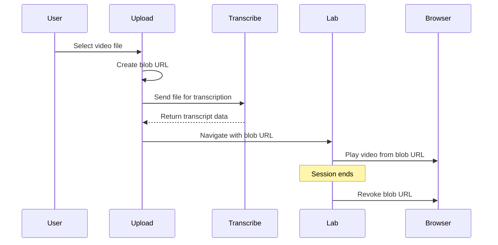

# Supabase Hybrid Storage Implementation

## Architecture Overview

```mermaid
flowchart TB
    subgraph browser [Browser]
        localStorage[localStorage<br/>API Keys]
        blobUrls[Blob URLs<br/>Session-only videos]
    end
    
    subgraph supabase [Supabase Database]
        transcripts[transcripts table]
        facts[facts table]
        insights[insights table]
        methodologies[methodologies table]
    end
    
    subgraph api [API Routes]
        transcribeAPI[/api/transcribe]
        factsAPI[/api/facts]
        insightsAPI[/api/insights]
        methodologiesAPI[/api/methodologies]
        transcriptAPI[/api/transcript]
    end
    
    browser -->|read keys| api
    api -->|store data| supabase
    api -->|read data| supabase
    browser -->|create blob| blobUrls
    blobUrls -->|playback| browser
```

## Database Schema

### Table: `transcripts`

```sql
CREATE TABLE transcripts (
  id TEXT PRIMARY KEY,
  title TEXT NOT NULL,
  text TEXT NOT NULL,
  language_code TEXT DEFAULT 'en',
  language_probability REAL DEFAULT 1.0,
  words JSONB NOT NULL,
  file_name TEXT,
  file_type TEXT,
  methodology_id TEXT REFERENCES methodologies(id),
  created_at TIMESTAMPTZ DEFAULT NOW(),
  updated_at TIMESTAMPTZ DEFAULT NOW()
);

CREATE INDEX idx_transcripts_methodology ON transcripts(methodology_id);
CREATE INDEX idx_transcripts_created_at ON transcripts(created_at DESC);
```

### Table: `facts`

```sql
CREATE TABLE facts (
  id UUID PRIMARY KEY DEFAULT gen_random_uuid(),
  transcript_id TEXT NOT NULL REFERENCES transcripts(id) ON DELETE CASCADE,
  fact_id TEXT NOT NULL,
  verbatim_quote TEXT NOT NULL,
  timestamp TEXT NOT NULL,
  speaker_label TEXT NOT NULL,
  sentiment TEXT NOT NULL CHECK (sentiment IN ('Positive', 'Neutral', 'Negative')),
  theme TEXT NOT NULL,
  summary_of_observation TEXT NOT NULL,
  created_at TIMESTAMPTZ DEFAULT NOW(),
  UNIQUE(transcript_id, fact_id)
);

CREATE INDEX idx_facts_transcript ON facts(transcript_id);
CREATE INDEX idx_facts_theme ON facts(theme);
```

### Table: `insights`

```sql
CREATE TABLE insights (
  id UUID PRIMARY KEY DEFAULT gen_random_uuid(),
  methodology_id TEXT NOT NULL REFERENCES methodologies(id) ON DELETE CASCADE,
  insight_id TEXT NOT NULL,
  level TEXT NOT NULL CHECK (level IN ('Principle', 'Strategic', 'Tactical')),
  type TEXT NOT NULL CHECK (type IN ('Behavioral', 'Functional', 'Need', 'Pain Point')),
  strength TEXT NOT NULL CHECK (strength IN ('Strong', 'Emerging')),
  context TEXT NOT NULL,
  cause TEXT NOT NULL,
  effect TEXT NOT NULL,
  relevance TEXT NOT NULL,
  evidence JSONB NOT NULL,
  recommendation TEXT NOT NULL,
  insight_summary JSONB,
  created_at TIMESTAMPTZ DEFAULT NOW(),
  UNIQUE(methodology_id, insight_id)
);

CREATE INDEX idx_insights_methodology ON insights(methodology_id);
```

### Table: `methodologies`

```sql
CREATE TABLE methodologies (
  id TEXT PRIMARY KEY,
  name TEXT NOT NULL,
  description TEXT,
  created_at TIMESTAMPTZ DEFAULT NOW(),
  updated_at TIMESTAMPTZ DEFAULT NOW()
);

CREATE INDEX idx_methodologies_created_at ON methodologies(created_at DESC);
```

## Implementation Steps

### 1. Install Supabase Dependencies

Add to `package.json`:

- `@supabase/supabase-js` - Supabase client library

### 2. Create Supabase Client

Create [`lib/supabase-client.ts`](lib/supabase-client.ts):

- Initialize Supabase client with environment variables
- Export typed database client
- Handle client-side vs server-side initialization

Environment variables needed:

- `NEXT_PUBLIC_SUPABASE_URL` - Supabase project URL
- `NEXT_PUBLIC_SUPABASE_ANON_KEY` - Supabase anonymous key
- `SUPABASE_SERVICE_ROLE_KEY` - Service role key (server-side only)

### 3. Create Database Utilities

Create [`lib/supabase-db.ts`](lib/supabase-db.ts) with functions:

**Transcripts:**

- `saveTranscript(transcriptId, data)` - Save transcript to Supabase
- `getTranscript(transcriptId)` - Load transcript from Supabase
- `updateTranscript(transcriptId, updates)` - Update transcript metadata
- `listTranscriptsByMethodology(methodologyId)` - Get all transcripts for a methodology

**Facts:**

- `saveFacts(transcriptId, facts[])` - Save facts array
- `getFacts(transcriptId)` - Load facts for a transcript
- `deleteFacts(transcriptId)` - Delete all facts for a transcript

**Insights:**

- `saveInsights(methodologyId, insightsData)` - Save insights
- `getInsights(methodologyId)` - Load insights for methodology

**Methodologies:**

- `createMethodology(name, description)` - Create methodology
- `listMethodologies()` - List all methodologies
- `getMethodology(id)` - Get single methodology
- `updateMethodology(id, updates)` - Update methodology

### 4. Update API Routes

**Replace file system operations with Supabase:**

- [`app/api/transcript/[id]/route.ts`](app/api/transcript/[id]/route.ts)
  - GET: Use `getTranscript()` instead of file read
  - POST: Use `saveTranscript()` instead of file write
  - PATCH: Use `updateTranscript()` instead of file update

- [`app/api/facts/[id]/route.ts`](app/api/facts/[id]/route.ts)
  - GET: Use `getFacts()` instead of file read
  - POST: Use `saveFacts()` instead of file write

- [`app/api/methodologies/route.ts`](app/api/methodologies/route.ts)
  - GET: Use `listMethodologies()` instead of directory read
  - POST: Use `createMethodology()` instead of file write

- [`app/api/methodologies/[id]/transcripts/route.ts`](app/api/methodologies/[id]/transcripts/route.ts)
  - GET: Use `listTranscriptsByMethodology()` instead of file system

- [`app/api/methodologies/[id]/insights/route.ts`](app/api/methodologies/[id]/insights/route.ts)
  - GET: Use `getInsights()` instead of file read
  - POST: Use `saveInsights()` instead of file write

### 5. Video Handling Changes

**Remove video file saving:**

- [`app/api/media/[id]/route.ts`](app/api/media/[id]/route.ts)
  - Remove POST endpoint (no longer save videos)
  - Keep GET endpoint for backward compatibility (return 404 or remove entirely)

- [`app/components/main/upload-modal.tsx`](app/components/main/upload-modal.tsx)
  - Remove media file save call after transcription
  - Create blob URL from uploaded file for session playback
  - Store blob URL in component state

- [`app/components/main/upload-with-methodology.tsx`](app/components/main/upload-with-methodology.tsx)
  - Same changes as upload-modal

- [`app/lab/[transcriptId]/page.tsx`](app/lab/[transcriptId]/page.tsx)
  - Remove media file URL loading logic
  - Accept blob URL as prop or state
  - Add cleanup: `URL.revokeObjectURL()` on unmount

- [`lib/load-saved-data.ts`](lib/load-saved-data.ts)
  - Remove `getMediaFileUrl()` function or make it return null
  - Update `loadSavedTranscript()` to not load media URLs

### 6. Update Components for Blob URL Handling

**Video Player Component:**

- [`app/components/sidebar/video-player.tsx`](app/components/sidebar/video-player.tsx)
  - Accept blob URL instead of file path
  - Handle blob URL cleanup on unmount

**Upload Flow:**

- After transcription succeeds, create blob URL from original file
- Pass blob URL to lab page via state or URL parameter
- Store blob URL in component state during session

### 7. Environment Configuration

Update `.env.local` (add to `.gitignore`):

```
NEXT_PUBLIC_SUPABASE_URL=your_supabase_url
NEXT_PUBLIC_SUPABASE_ANON_KEY=your_anon_key
SUPABASE_SERVICE_ROLE_KEY=your_service_role_key
```

### 8. Migration Strategy

**Data Migration (Optional):**

- Create migration script to move existing file-based data to Supabase
- Script reads from `/data/transcriptions/` and `/data/methodologies/`
- Inserts into Supabase tables
- Run once before switching to Supabase

## Files to Create

- `lib/supabase-client.ts` - Supabase client initialization
- `lib/supabase-db.ts` - Database operation functions
- `scripts/migrate-to-supabase.ts` - Optional migration script
- `supabase/migrations/001_initial_schema.sql` - Database schema SQL

## Files to Modify

- `package.json` - Add Supabase dependency
- `app/api/transcript/[id]/route.ts` - Use Supabase
- `app/api/facts/[id]/route.ts` - Use Supabase
- `app/api/methodologies/route.ts` - Use Supabase
- `app/api/methodologies/[id]/transcripts/route.ts` - Use Supabase
- `app/api/methodologies/[id]/insights/route.ts` - Use Supabase
- `app/api/media/[id]/route.ts` - Remove POST, optionally remove GET
- `app/components/main/upload-modal.tsx` - Blob URL handling
- `app/components/main/upload-with-methodology.tsx` - Blob URL handling
- `app/lab/[transcriptId]/page.tsx` - Blob URL handling
- `lib/load-saved-data.ts` - Remove media URL loading
- `.gitignore` - Add `.env.local`

## Video Handling Flow



## Benefits

- Cross-device sync via Supabase
- No server file storage needed
- Videos not stored (privacy + cost savings)
- API keys remain local (BYOK model)
- Automatic backups via Supabase
- Real-time updates possible

## Considerations

- Requires Supabase account (free tier available)
- Need to set up database schema in Supabase dashboard
- Migration needed for existing data (if any)
- Videos must be re-uploaded for playback (by design)